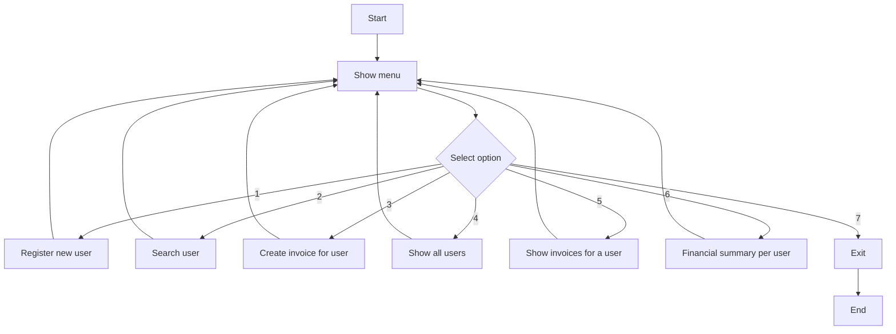

# CRM System – README

## Project Overview
This project implements a basic CRM (Customer Relationship Management) system following the functional requirements described in the assignment brief. It was developed using Python and Django, storing data in SQLite via Django’s ORM.

## Features Implemented (based on assignment requirements up to point 3)
- User Registration (with validations for required fields, email format, and uniqueness)
- Invoice Creation (linked to existing users, with autogenerated invoice number and date)
- Search functionality (search users by name or email)
- Display all users
- List all invoices for a selected user
- Financial summary per user (total amount from their invoices)

## Technologies Used
- Python 3
- Django Framework
- SQLite (default Django database)

## How to Run the Project
1. Make sure you have Python 3 installed.
2. Install dependencies:
   ```
   pip install -r requirements.txt
   ```
3. Run database migrations:
   ```
   python manage.py makemigrations
   ```
   ```
   python manage.py migrate
   ```
4. Run the development server:
   ```
   python manage.py runserver
   ```
5. Open your browser and go to:
   ```
   http://127.0.0.1:8000/
   ```

## Functional Coverage 
- User registration with validations (email format, uniqueness, required fields)
- Invoice creation linked to registered users with autogenerated invoice number and date
- Search and query functions: list users, search by email/name, list invoices, and financial summaries

## Data Types and Structures
- **Strings** for names, emails, phone numbers, descriptions, and dates
- **Floats** for invoice amounts
- **Django Models** to represent users and invoices
- **Django ORM** for database operations and relations

These structures provide clear data integrity and easy interaction with the web interface.

## Flowchart (Mermaid)


## Challenges
- Ensuring all validations and logical consistency through Django Forms and Models
- Keeping the web interface simple and user-friendly
- Making the system modular and maintainable

## Notes
No external images or extra libraries are required. Everything runs with standard Django and SQLite.

## Author
Antonio Samuel Cantarero Malagón
